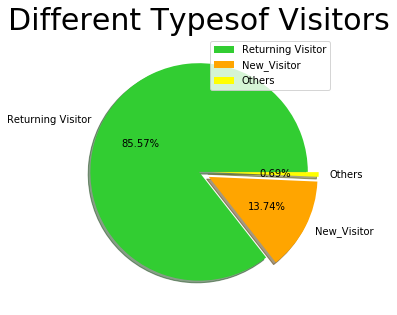
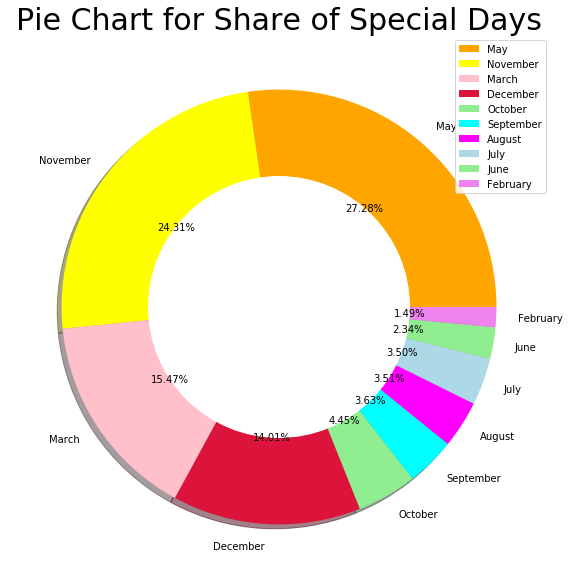

# Customer-Purchasing-Intention-Analysis
Customer Purchasing Intention Analysis

1. Using Data Wrangling techniques of Gathering, Accessing and, Cleaning the data 
2. Illustrating customer purchasing data using various graphs and visualization on Python libraries

